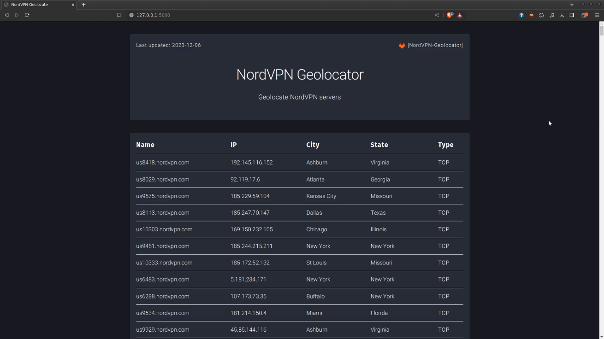

# NordVPN Geolocator

Geolocate NordVPN servers that are located in the US. Display them in a flask web app or parse the raw json data.

## Requirements:
* [fernmelder](https://github.com/stealth/fernmelder/) (async mass DNS resolve)

You can change the lookup country code [US, RU, CH] and connection type [UDP, TCP] in the *nordvpn-geolocator/app.py* file.

